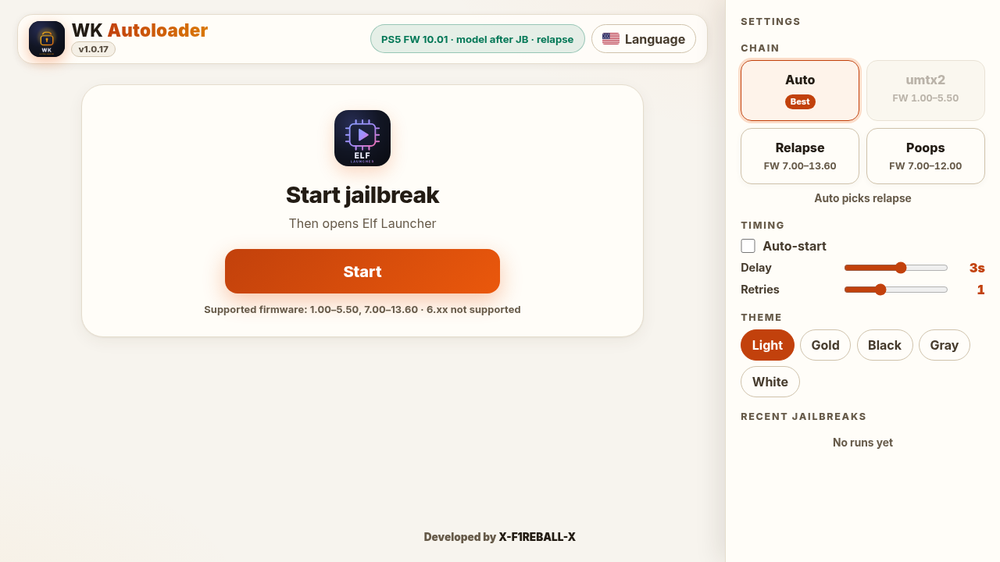

Home screen jailbreak host for a jailbroken PS5. Runs the exploit chain, then opens Elf Launcher.

## Quick start

1. Soft jailbreak and start [elfldr](https://github.com/ps5-payload-dev/elfldr) on port 9021.
2. Send `wk-autoloader.elf` from the [latest release](https://github.com/X-F1REBALL-X/wk-autoloader/releases/latest). Wait for the home icon.
3. Open the home tile, or `http://<PS5 IP>:1022` from your phone or PC.

Everything else, including what's new in 1.1.0, is in the [guide](https://x-f1reball-x.github.io/wk-autoloader/guide/).

Developed by [X-F1REBALL-X](https://github.com/X-F1REBALL-X).

Credits: umtx2 (idlesauce, shahrilnet, n0llptr, SpecterDev, ChendoChap, abc, john-tornblom); Relapse (ntfargo, ufm42, Sonic_Iso, Jordy, Dr. Yenyen, TheFlow, SlidyBat, Flatz, cow, nhk, bollarz, Sleirsgoevy, EchoStretch, EarthOnion).
